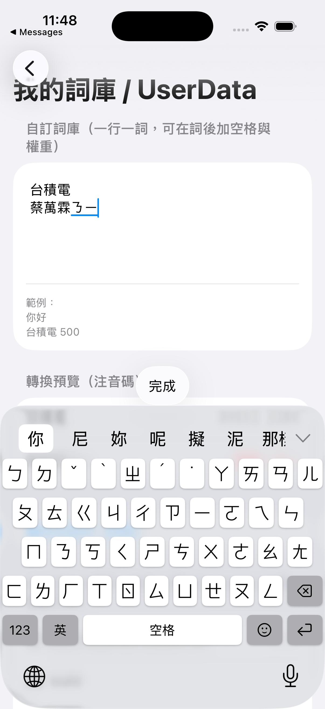
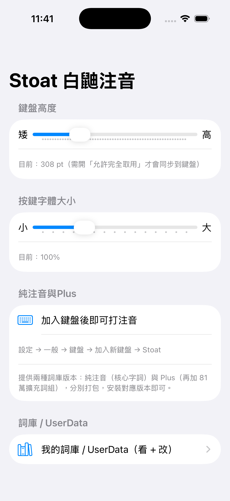

# Stoat 白鼬注音

iOS 自製**注音輸入法**——以自建 `librime.xcframework` 為引擎，從 macOS Squirrel SPEC 移植，詞庫引用**洋蔥純注音**與**洋蔥 Plus**（[oniondelta / Onion_Rime_Files](https://github.com/oniondelta/Onion_Rime_Files)），主打「貼近 Apple 原廠手感 ＋ RIME 強大選字」。

<p align="center">
  
  &nbsp;&nbsp;
  
</p>
<p align="center"><sub>左：注音鍵盤實際運作（內嵌組字「ㄋㄧ」→ 候選 你/尼/妳/呢…）　右：容器 App 設定</sub></p>

- **Bundle**：`com.frost.stoat`（鍵盤 `com.frost.stoat.keyboard`）
- **平台**：iOS 16.0+（iOS 26 視覺特性自動加載）
- **引擎**：librime（自建 xcframework，含 librime-lua + octagram + predict）
- **詞庫**：洋蔥純注音 `bopomo_onion.schema.yaml` + 洋蔥 Plus 擴充詞組（phrases.chtp），預編譯 `.bin` 隨 App 打包

---

## 特點

### 輸入核心
- **聲韻母亂序（free-order）** — RIME 精髓。聲母、韻母、聲調不必照順序打，引擎自動還原正確字。
- **大千鍵位 ≡ QWERTY 實體鍵** — 同一顆鍵服務注音輸入；注音鍵**上下划即輸入英文**（ㄆ↔q、ㄇ↔a、ㄈ↔z…），不必切頁。
- **智慧候選排序** — octagram 語法模型（`contextual_suggestions`）依上下文重排候選，越打越準。
- **預測候選** — 選字後接續預測下一詞。
- **注音內嵌輸入框（可開關）** — 開：組字注音顯在打字的輸入框（marked text，像原廠）；關：注音顯在候選列、跨宿主較快。⚙ 選單切換。

### 候選體驗（比照原廠）
- **展開候選面板** — 點候選列右側 chevron，鍵盤區展開成**扁平等寬格狀**候選（列間細橫線分隔），再點收合。
- **emoji 候選** — 打「哈哈哈」直接出 🤣。
- **顏文字候選** — 與輸入連動。
- **生僻字 tofu 過濾** — 字型無法顯示（豆腐格）的候選自動濾除。
- 候選無編號、原廠灰 chevron，視覺對齊系統鍵盤。

### 鍵盤版面
- **原廠風格變動高度** — 總高度隨列數變（注音最高、英文/123 較矮）；**鍵寬/鍵高像素對標原廠**（注音列多、鍵略矮＝原廠比例；英文鍵較高，§182–187）。
- **功能列空白鍵置中** — 注音/英文/123 三模式空白鍵皆置中（兩拇指等距）；123 頁 Enter 加大。
- **英文 QWERTY 頁** — 對齊 iOS 原廠，含可選常駐數字列。
- **123 數字符號頁** — 半／全形依中英模式自動切換，亦可在設定強制。
- **表情／顏文字面板** — emoji 鍵為原廠線條笑臉圖示；面板**水平（左右）捲動**瀏覽、分類 chip、內建 ⌫（長按連刪）。emoji 集對標 **iOS 26（Unicode 16.0）**、原廠分類順序。
- **iOS 26 圓角** — 鍵盤上緣與按鍵採連續（squircle）圓角。
- **Liquid Glass 玻璃按鍵** — iOS 26 可選開關（預設關，原廠實心白鍵/灰功能鍵）。開啟後可再選 **玻璃風格**（霜面／透明）與 **色調**（無色／藍／灰／暖）。
- **色調與玻璃風格** — iOS 26 玻璃按鍵開啟時，⚙ 輸入選項提供「**玻璃風格**」（霜面 `UIGlassEffect .regular`／透明 `.clear`）與「**色調**」（無色／藍／灰／暖）即時切換。

### 手感細節
- ⌫ 長按**連續刪除**；空白鍵長按**滑動移游標**。
- 中／英快切鍵常駐功能列。
- 原廠按壓高亮動畫（按下即時、放開淡出）。
- 簡繁、全半形、標點切換。
- **第一列快捷列可開關**（⚙）— idle 時的「標點」與「顏文字」兩段各自開/關；兩段全關時連空候選列一併收起、鍵盤自動變矮、不留空白帶。

### 切換手感（對標原廠）
- **不疊加自家動畫** — 高度變更全程非動畫，切 App 不會額外彈跳。
- **轉場交給系統** — 不在系統轉場期重繪介面，純讓系統 snapshot/轉場動畫處理，貼近原廠平順。
- **App resume 後乾淨重套** — 掛 `willEnterForegroundNotification`，回前景後在轉場完成時校正高度。
- 誠實邊界：自訂鍵盤跨進程、只能在首繪後改高，首次呈現的微 flash 為 iOS 系統限制（Apple DTS 證實）、原生無法完全消除；App 切換的卡片動畫亦為系統行為。

### 設定與部署
- **鍵盤內建選項選單**（⚙）— 側載重簽會使 App Group 失效，故選項直接存鍵盤本地，側載也可用。
- **自訂詞庫 / UserData** — 容器 App 內可看可改個人詞庫。
- **免裝機部署** — bundle 內帶預編譯 `.bin`，`prebuilt_data_dir` 直接指過去，裝置端免重建。

### 隱私
- **全程離線**，無網路請求。
- **無語音輸入**（iOS 自訂鍵盤沙盒無法錄音／叫起聽寫，已整段移除）。
- 個人詞庫僅存於裝置本地。

---

## 版本與風格

主線 **`line-0.1.185`**（release `v0.1.185`），單一候選條版面（注音內嵌輸入框、候選 + ⌄ 同列；⚙ 改長按 `123` 叫出）。另提供 **iOS 18 風格變體**：

| 風格 | git 分支 / tag | 鍵盤外觀 |
|------|---------------|---------|
| **iOS 26**（預設） | `line-0.1.185` / `v0.1.185` | Liquid Glass 半透材質、squircle 圓角、`systemGray` 語意色 |
| **iOS 18 扁平** | `line-ios18-0.1.185` / `v0.1.185-ios18` | 實心底（`systemGray4/5`）、5pt circular 方鍵、外框圓角**跟隨系統**、配色全 SDK 語意、保留玻璃切換 |

> 兩風格**僅差鍵盤外觀**（由 `KeyboardViewController.flatStyleIOS18` flag 控制，iOS18 版唯一差此一行）；輸入核心、emoji、詞庫（plustrim）、版面皆共用。
>
> **目前維護**：`line-0.1.185`（iOS26，`v0.1.185`）＋ `line-ios18-0.1.185`（iOS18，`v0.1.185-ios18`），詞庫皆 plustrim。**已封存**：`archive/line-0.1.120-frozen`（§133 合併控制列版面）、`archive/main-v0.1.120`（舊基線）；舊穩定 tag `v0.1.141`/`v0.1.141-ios18` 保留為歷史快照。
>
> iOS 18 風格在 iOS 26 裝置上以 flag 手動重現——iOS 不公開鍵盤鍵色、且 runtime 渲染由裝置 OS 決定，故無法靠 build SDK 切換；色彩一律取自 SDK `systemGray` 語意（跨版穩定＝官方值），系統需圓角處（外框）以系統為優先。

各風格再分 **full**（Plus 全詞庫）/ **plustrim**（Plus 精選，**0.1.183 穩定版採用**）/ **lite**（純注音核心）三詞庫，見下方建置。

---

## 架構

```
rimeless/
├─ OnionKB/              # Xcode 專案（容器 App + 鍵盤 extension 兩 target）
│  ├─ App/               #   容器 App（設定、詞庫管理、狀態）
│  ├─ Keyboard/          #   鍵盤 extension（KeyboardViewController…）
│  ├─ Shared/Rime/       #   RimeBridge.mm（librime C API 的 ObjC++ 薄包裝）
│  └─ Scripts/           #   package-ipa.sh（unsigned device build → IPA）
├─ RimeData/
│  ├─ shared/            #   schema / 詞庫源（bopomo_onion.schema.yaml…）
│  └─ build/             #   預編譯 .bin（prism / table / reverse）
└─ ios-build/            # librime.xcframework 建置（含 selftest）
```

**資料流**：大千鍵 → keycode → `RimeBridge` → librime → 組字／候選／上字 → UI。
引擎與 UI 以 `RimeEngine` 協定解耦（真 `RimeEngineLibrime` / 後備 `RimeEngineStub`）。

---

## 建置

**模擬器（驗證編譯）**
```bash
cd OnionKB
xcodebuild -project OnionKB.xcodeproj -scheme OnionKB \
  -sdk iphonesimulator -configuration Debug \
  ARCHS=arm64 ONLY_ACTIVE_ARCH=YES build
```

**選擇詞庫變體：純注音（lite）/ Plus（full）**

本鍵盤提供**兩種詞庫版本，分別打包成獨立 IPA**（不在 App 內即時切換——librime 全域重載會出字異常）。`RimeData/build/` 不入庫，打包前用 `select-variant.sh` 從 `RimeData-variants/build-full/`（Plus）或 `build-lite/`（純注音）生成：

| 變體 | 名稱 | 詞庫 | IPA | 適用 |
|------|------|------|-----|------|
| **full** | **Plus** | 純注音 + 81 萬 phrases.chtp 擴充詞組（table.bin 28MB）| ~64MB | 詞組完整、對齊 Squirrel onionplus |
| **plustrim** | **Plus 精選** | Plus 依 essay 語料頻率篩留 35.6 萬詞（table.bin 14MB，§175）| ~45MB | 詞彙豐富又輕快、容量與流暢度平衡（**0.1.183 穩定版**）|
| **lite** | **純注音** | 純注音核心（~118K，table.bin 7.5MB）| ~48MB | 輕量、省記憶體 |

兩者皆 B 方案（bgc grammar，候選出「為」）+ librime 1.17.0，且**表情候選已接線**（打「哈哈哈」候選列出 🤣，schema 掛 `simplifier@emoji`）。
> 變體 .bin 存於 `RimeData-variants/`（不在 `RimeData/` 內，避免 bundle folder reference 把兩變體都打包進 IPA）。

```bash
bash OnionKB/Scripts/select-variant.sh full    # 或 lite
```

**裝置 IPA（unsigned，側載重簽）**
```bash
bash OnionKB/Scripts/select-variant.sh full    # 先選變體（full / lite）
cd OnionKB
bash Scripts/package-ipa.sh        # 產出 build/ipa/OnionKB.ipa
```
以 AltStore／Sideloadly 等工具重簽安裝；裝後於
**設定 → 一般 → 鍵盤 → 加入新鍵盤 → Stoat**，並開「允許完全取用」以同步設定。

**iOS 18 扁平風格版**

兩種做法，擇一：

```bash
# 方法 A：切到已 baked flag 的分支（推薦）
git checkout v0.1.185-ios18        # 或 line-ios18-0.1.185 分支
bash OnionKB/Scripts/select-variant.sh plustrim   # 穩定版詞庫（或 full / lite）
cd OnionKB && bash Scripts/package-ipa.sh

# 方法 B：在主線手動翻 flag
#   編輯 OnionKB/Keyboard/KeyboardViewController.swift：
#   static let flatStyleIOS18 = true
#   再 select-variant + package-ipa
```

差別僅鍵盤外觀（實心底／方鍵）；詞庫、版面、功能皆同 iOS 26 版。

---

## 文件

- **`CHANGELOG.md`** — 由動工到最新版的時序紀錄，每里程碑附 Debug／設計 Insight。

---

## 授權

- **本專案原創程式碼**（`OnionKB/` 下的 Swift App 與鍵盤 extension）依 **GNU GPL-3.0** 釋出，全文見 [`LICENSE`](LICENSE)。
- 本倉庫散佈時包含 **librime（BSD-3-Clause）**、RIME 語言資料/模型、洋蔥純注音詞庫等第三方元件，各有其自身授權——清單、出處與散佈前檢查見 [`NOTICE`](NOTICE)。
- 公開散佈前請務必依 `NOTICE` 核實各上游授權；標 ⚠ 者尤需確認。
